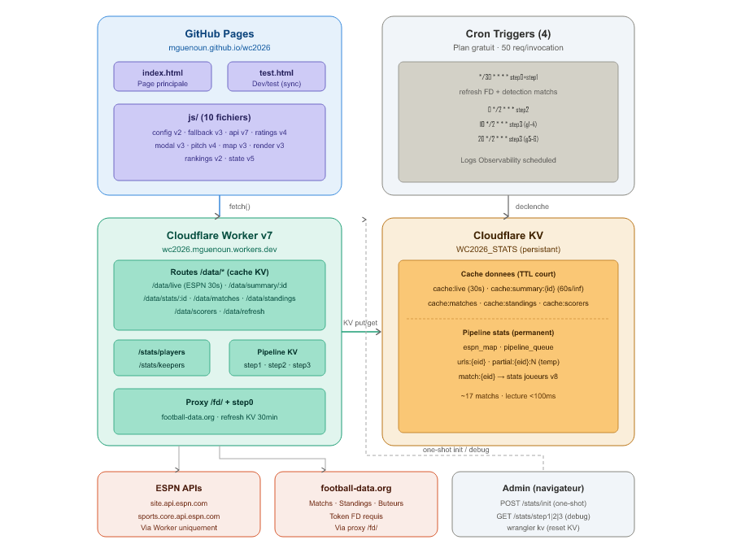
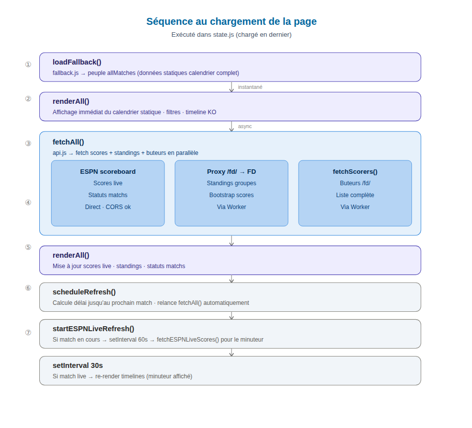
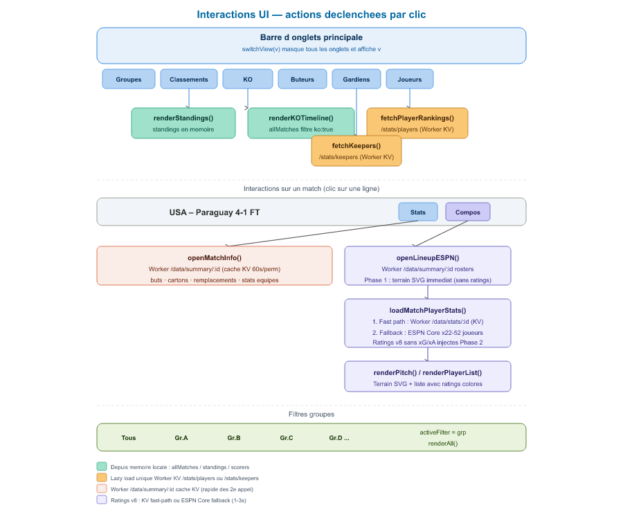

# WC2026 Dashboard — Architecture & Documentation

## Vue d'ensemble

Dashboard de suivi de la Coupe du Monde 2026 (USA/Canada/Mexique), déployé en tant que site statique sur **Cloudflare Pages** (branches `main` → prod, `staging` → recette) avec un backend serverless sur **Cloudflare Workers** (v7) et un cache persistant **Cloudflare KV**.

---

## Architecture globale

```
┌─────────────────────────────────────────────────────────────────┐
│                   Cloudflare Pages                               │
│   wc2026.pages.dev  ·  branches main (prod) / staging (recette)│
│                                                                  │
│   index.html (page principale)                                  │
│   js/                                                           │
│     config.js   fallback.js   api.js      ratings.js           │
│     modal.js    pitch.js      map.js      render.js             │
│     rankings.js state.js                                        │
└──────────────────┬──────────────────────────────────────────────┘
                   │ fetch()
                   ▼
┌─────────────────────────────────────────────────────────────────┐
│                  Cloudflare Worker v7                            │
│   https://wc2026.mguenoun.workers.dev                          │
│                                                                  │
│   Routes données (cache KV) :                                   │
│   /data/live             → ESPN scoreboard (cache 30s)          │
│   /data/summary/:id      → ESPN summary (cache 60s/permanent)   │
│   /data/stats/:id        → Stats joueurs depuis KV pipeline     │
│   /data/matches          → Matchs FD (cache KV)                 │
│   /data/standings        → Classements FD (cache KV)            │
│   /data/scorers          → Buteurs FD (cache KV)                │
│   /data/refresh          → Force refresh FD (step0)             │
│                                                                  │
│   Routes stats & pipeline :                                      │
│   /stats/players         → Classement joueurs (depuis match:*)  │
│   /stats/keepers         → Classement gardiens (depuis match:*) │
│   /stats/status          → État du pipeline                     │
│   /stats/init            → POST : initialisation ESPN_ID_MAP    │
│   /stats/step1|2|3       → Déclenchement manuel pipeline        │
│                                                                  │
│   Proxy :                                                        │
│   /fd/*                  → Proxy football-data.org              │
│                                                                  │
│   Cron Triggers :                                                │
│   */30 * * * *       → step0 (refresh FD) + step1 (découverte) │
│   0 */2 * * *        → step2 : fetch URLs joueurs               │
│   10 */2 * * *       → step3 : fetch stats groupes 1-4          │
│   20 */2 * * *       → step3 : rattrapage groupes 5-6           │
└──────────┬──────────────────────┬───────────────────────────────┘
           │                      │
           ▼                      ▼
┌──────────────────┐   ┌─────────────────────────────────────────┐
│ football-data.org│   │          Cloudflare KV                  │
│ ESPN APIs        │   │   WC2026_STATS (namespace)              │
│ (sources données)│   │                                          │
│                  │   │   Cache données (TTL court) :            │
│ Tout passe via   │   │   cache:live       → ESPN 30s           │
│ le Worker        │   │   cache:summary:{id} → ESPN 60s/∞      │
│ (aucun appel     │   │   cache:matches    → FD matchs          │
│  ESPN direct     │   │   cache:standings  → FD standings        │
│  depuis le nav.) │   │   cache:scorers    → FD buteurs (3h)    │
└──────────────────┘   │                                          │
                        │   Pipeline stats (permanent) :          │
                        │   espn_map        → mapping M1→760415  │
                        │   pipeline_queue  → {pending,done,...}  │
                        │   urls:{eid}      → URLs stats (temp)   │
                        │   partial:{eid}:N → stats groupe N      │
                        │   match:{eid}     → stats finales ✓    │
                        └─────────────────────────────────────────┘
```

---

## Composants GitHub Pages

### Structure des fichiers

```
wc2026/
├── index.html             # Page principale (Cloudflare Pages)
└── js/
    ├── config.js      v2  # Constantes, maps, utilitaires
    ├── fallback.js    v3  # Données statiques matchs (63 matchs + KO)
    ├── api.js         v10 # Fetch Worker, traitement scores live
    ├── predictions.js v5  # Modèle Poisson v4 (prédictions matchs à venir)
    ├── ratings.js     v4  # Algo rating joueurs v8 (sans xG/xA)
    ├── modal.js       v7  # Modales stats match + lien YouTube par but
    ├── pitch.js       v4  # Terrain SVG, compositions, openLineupESPN
    ├── map.js         v6  # Vue liste matchs + prédictions score + ▶ YouTube
    ├── render.js      v10 # Timelines, bracket KO, Meilleurs 3èmes
    ├── rankings.js    v3  # Gardiens, buteurs, classement joueurs (avec Min)
    └── state.js       v6  # renderAll, switchView (7 vues), scheduleRefresh
```

### Ordre de chargement des scripts (critique)

```html
<script src="js/config.js?v=2"></script>       <!-- 1. Constantes globales -->
<script src="js/fallback.js?v=3"></script>     <!-- 2. Données statiques -->
<script src="js/api.js?v=10"></script>         <!-- 3. Fetch Worker/FD -->
<script src="js/predictions.js?v=5"></script>  <!-- 4. Modèle Poisson v4 -->
<script src="js/ratings.js?v=4"></script>      <!-- 5. Algo rating v8 -->
<script src="js/modal.js?v=7"></script>        <!-- 6. Modales + YouTube par but -->
<script src="js/pitch.js?v=4"></script>        <!-- 7. Terrain SVG -->
<script src="js/map.js?v=6"></script>          <!-- 8. Vue liste + prédictions -->
<script src="js/render.js?v=10"></script>      <!-- 9. Rendu groupes + KO + Meilleurs 3èmes -->
<script src="js/rankings.js?v=3"></script>     <!-- 10. Classements joueurs -->
<script src="js/state.js?v=6"></script>        <!-- 11. Init + orchestration (7 vues) -->
```

### Variables globales clés (config.js)

| Variable | Description |
|---|---|
| `PROXY_BASE` | URL du Worker (`https://wc2026.mguenoun.workers.dev`) |
| `ESPN_ID_MAP` | Mapping matchKey → ESPN event ID (ex: `'M1':'760415'`) |
| `TEAM_MAP` | Noms d'équipes ESPN → noms français |
| `GC` | Couleurs par groupe (`{A:'#color', B:'#color', ...}`) |
| `allMatches` | Array des matchs (peuplé par `loadFallback()`) |
| `standings` | Classements par groupe (peuplé par `fetchAll()`) |
| `scorers` | Liste des buteurs (peuplé par `fetchAll()`) |
| `activeFilter` | Filtre groupe actif ('all' ou lettre) |
| `_currentMatch` | Match actuellement ouvert en modale |
| `DISPLAY_TZ` | Timezone d'affichage (`Africa/Casablanca`) |

---

## Cloudflare Worker v7 (worker.js)

### Step 0 — Refresh données FD (toutes les 30min avec step1)

- Fetch matchs FD → écrit `cache:matches` (différentiel, seulement si changement)
- Si changement détecté → fetch standings FD → écrit `cache:standings`
- Fetch buteurs FD toutes les 3h → écrit `cache:scorers`

### Routes cache KV (front → Worker → KV)

| Route | Source | TTL |
|---|---|---|
| `/data/live` | ESPN scoreboard J-1 + J | 30s |
| `/data/summary/:id` | ESPN summary | 60s si live, permanent si terminé |
| `/data/stats/:id` | KV `match:{id}` (pipeline) | Permanent |
| `/data/matches` | KV `cache:matches` | ~30min (step0) |
| `/data/standings` | KV `cache:standings` | ~30min si changement (step0) |
| `/data/scorers` | KV `cache:scorers` | 3h (step0) |

### Pipeline de calcul des stats joueurs

Le plan gratuit Cloudflare limite chaque invocation à **50 sous-requêtes HTTP**. Le pipeline découpe le traitement en 3 étapes :

#### Step 1 — Découverte (~8 sous-requêtes)
- Scan ESPN scoreboards sur les 7 derniers jours
- Détecte les nouveaux matchs terminés → alimente `espn_map`
- Compare avec `pipeline_queue` → ajoute les ESPN IDs non traités dans `queue.pending`

#### Step 2 — Fetch URLs (~7 sous-requêtes)
- Prend le premier match `pending`
- Fetch ESPN summary (1) + competitors (1) + 2 rosters (2×2)
- Extrait les URLs de stats individuelles (22-52 joueurs)
- Stocke dans `KV["urls:{eid}"]`
- Déplace en `queue.processing`

#### Step 3 — Fetch stats par groupes de 10 (~12-42 sous-requêtes)
- Lit `KV["urls:{eid}"]`
- Fetch les stats de 10 joueurs en SÉQUENCE (pas Promise.all)
- Maximum 4 groupes par invocation (40 appels max, sous la limite de 50)
- Stocke dans `KV["partial:{eid}:{N}"]`
- Quand tous les groupes sont prêts → assemble dans `KV["match:{eid}"]`

### KV Keys

| Clé | Contenu | Durée de vie |
|---|---|---|
| `cache:live` | Events ESPN scoreboard J-1+J | 30s |
| `cache:summary:{eid}` | ESPN summary complet | 60s (live) / permanent (FT) |
| `cache:matches` | Matchs FD (différentiel) | Mis à jour par step0 (~30min) |
| `cache:standings` | Classements FD | Mis à jour par step0 si changement |
| `cache:scorers` | Buteurs FD top 20 | Mis à jour toutes les 3h |
| `espn_map` | Mapping matchKey → ESPN ID + infos | Permanent |
| `pipeline_queue` | `{ pending:[], processing:[], done:[] }` | Permanent |
| `urls:{eid}` | URLs stats joueurs + infos match | Temporaire (supprimé après assemblage) |
| `partial:{eid}:{N}` | Stats du groupe N de joueurs | Temporaire (supprimé après assemblage) |
| `match:{eid}` | Stats finales de tous les joueurs | Permanent |

### Secrets (Cloudflare Dashboard → Settings → Variables and Secrets)

| Nom | Description |
|---|---|
| `API_TOKEN_FD` | Clé API football-data.org |
| `API_TOKEN` | Clé API football-data.org (alias legacy) |

### KV Namespace Binding

| Variable name | KV Namespace | Namespace ID |
|---|---|---|
| `STATS_KV` | `WC2026_STATS` | `749700d94d114156a758b14e2e9b6587` |

### Cron Triggers

| Expression | Fréquence | Rôle |
|---|---|---|
| `*/30 * * * *` | Toutes les 30min | step0 (refresh FD) + step1 (détection matchs) |
| `0 */2 * * *` | Toutes les 2h | step2 : fetch URLs du prochain match pending |
| `10 */2 * * *` | Toutes les 2h + 10min | step3 : fetch stats groupes 1-4 |
| `20 */2 * * *` | Toutes les 2h + 20min | step3 : rattrapage groupes 5-6 |

---

## Sources de données

| Source | Usage | Accès |
|---|---|---|
| **ESPN** `site.api.espn.com` | Scores live, compositions, stats match | Via Worker `/data/live`, `/data/summary/:id` |
| **ESPN Core** `sports.core.api.espn.com` | Stats détaillées joueurs (pipeline) | Direct depuis Worker (step2/step3) |
| **football-data.org** | Matchs, standings, buteurs | Via Worker `/fd/*` + cache KV |

> Aucun appel ESPN n'est fait directement depuis le navigateur. Tout passe par le Worker, qui maintient un cache KV pour limiter les requêtes upstream.

---

## Algo Rating Joueurs (v8)

Formule par poste avec architecture `base + volScore + offScore` :

- **Base** : 6.3 pour tous les postes
- **Per90 atténué** : `1 + (90/min - 1) × 0.2` (évite la distorsion sur peu de minutes)
- **progCarries** plafonné à 6 avant normalisation
- **volScore** (métriques de volume/défense) : plafonné selon poste (1.2 CM → 1.8 DEF/FB/AM)
- **offScore** (buts, assists, tirs cadrés) : plafonné à 2.5 (2.8 pour FW)
- **Carton rouge** : -1.0 / **Carton jaune** : -0.3
- **Plage** : [4.0 — 9.5]
- **Sans xG/xA** : supprimés en v8 (causaient une inflation de +0.1 à +0.5 pts sur AM/FW vs SofaScore/FotMob)

Poids par rôle :

| Rôle | Vol principal | Off principal | Pénalité |
|---|---|---|---|
| GK | saves×0.35, cs×0.30 | goals×2.0 | — |
| DEF | tackles×0.15, duels×0.80, cs×0.35 | goals×1.8 | — |
| FB | crosses×0.15, duels×0.65, cs×0.25 | goals×1.6, assists×1.0 | — |
| DM | tackles×0.18, passes×0.60 | goals×1.5 | — |
| CM | passes×0.45, duels×0.45 | goals×1.4, shots×0.15 | — |
| AM | shots×0.20, progCarries×0.08 | goals×1.4, assists×0.90 | -0.15 si shots<0.5 |
| FW | — | goals×1.5, shots×0.22, assists×0.80 | -0.20 si shots<0.5 |

---

## Prédictions de Score — Modèle Poisson v4 (predictions.js)

Les prédictions sont calculées côté navigateur pour chaque match **à venir** (non démarré, non terminé, sans placeholder KO).

### Prior FIFA

Chaque équipe dispose d'un **rating FIFA officiel** (juin 2026, 48 équipes). En l'absence de stats de tournoi, le modèle revient à ce prior :

```
priorGF_A = avgGF × (fifaA / avgFifa)^1.5
priorGA_A = avgGA × (avgFifa / fifaA)^1.5
```

- `avgGF` / `avgGA` : buts par équipe par match calculés depuis les classements en cours
- `avgFifa` ≈ 1580 (moyenne des 48 équipes)
- Exposant 1.5 : différencie suffisamment sans exagérer (Maroc vs Écosse → ~58% favori)

### Régression bayésienne K=6

Après chaque match joué, les stats réelles ne pèsent que `w = played / (played + K)` :

```
w = played / (played + 6)
gf_A = w × rawGF_A + (1-w) × priorGF_A
ga_A = w × rawGA_A + (1-w) × priorGA_A
```

Avec K=6, après 1 match joué le poids sur les stats réelles est seulement 14%. Cela évite qu'une défaite difficile (ex: 0-2 vs Brésil J1) écrase le prior d'une équipe de niveau mondial.

### Paramètres Poisson

```
lambdaA = clip(gf_A × ga_B / avgGF, 0.2, 4.0)
lambdaB = clip(gf_B × ga_A / avgGF, 0.2, 4.0)
```

La distribution de Poisson bivarié P(i buts A, j buts B) = PMF(λA, i) × PMF(λB, j) est calculée sur une grille 8×8 (0 à 7 buts chaque côté).

### Argmax par catégorie

Les probabilités sont séparées en trois catégories :
- **V (Victoire A)** : somme des P(i,j) avec i > j
- **N (Nul)** : somme des P(i,j) avec i = j
- **D (Défaite A)** : somme des P(i,j) avec i < j

Le **score affiché** est le score (i,j) maximisant P dans la catégorie la plus probable (pas le score global le plus probable, ce qui permettrait d'afficher un nul 0-0 même quand V=55%).

### Affichage (map.js v6)

Pour chaque match à venir, la ligne affiche :
- `🎯 X-Y` en orange (stats disponibles) ou gris (prior FIFA uniquement)
- `Vxx% · Nxx% · Dxx%` colorisés : vert si favori, rouge si perdant, gris si nul prédit
- Tooltip : `Poisson λ=X.X / Y.Y`

`buildPredictions()` est appelé depuis `api.js` après chaque `fetchAll()` et après chaque mise à jour de standings en live.

---

## Classement Joueurs (rankings.js v3 + Worker /stats/players)

### Pipeline de calcul (Worker)

`handlePlayers()` agrège toutes les clés `match:{eid}` du KV pour construire le classement :

```
Pour chaque joueur sur tous les matchs :
  totalMinutes += minutes_jouées_ce_match
  totalRating  += rating_ce_match × minutes_jouées_ce_match
  goals        += buts
  assists      += passes décisives
  matches      += 1

rating_final = totalRating / totalMinutes   (moyenne pondérée par minutes)
```

Le classement est trié par `rating_final` décroissant.

### Algo Rating v8 (ratings.js)

Formule par poste : `rating = 6.3 + volScore + offScore`

| Métrique | Description |
|---|---|
| **Per90 atténué** | `1 + (90/min − 1) × 0.2` — atténue la distorsion sur peu de minutes |
| **volScore** | Métriques de volume/défense (tackles, passes, duels, saves, CS) — plafonné 1.2→1.8 selon poste |
| **offScore** | Buts, assists, tirs cadrés — plafonné à 2.5 (2.8 FW) |
| **Carton rouge** | −1.0 |
| **Carton jaune** | −0.3 |
| **Plage finale** | [4.0 — 9.5] |

Sans xG/xA (supprimés en v8 car causaient une inflation de +0.1 à +0.5 sur AM/FW vs SofaScore).

### Colonnes affichées

| Colonne | Description |
|---|---|
| **MJ** | Matchs joués (cumul) |
| **Min** | Minutes cumulées sur tous les matchs |
| **⚽** | Buts totaux (cumul) |
| **→** | Passes décisives totales (cumul) |
| **Moy.** | Note moyenne pondérée par minutes — critère de classement |

---

## Refresh des scores live

`state.js` — `scheduleRefresh()` toutes les **30s** (setTimeout récursif) :

```
Tick N :
  hasLive = allMatches.some(m => m.isLive)   ← évalué au moment du tick
  Si hasLive       → fetchESPNLiveScores()    [Worker /data/live, cache 30s]
  Si tick%5 == 0   → fetchAll()              [refresh complet toutes les 2.5min]
  Sinon tick%10==0 → fetchAll()              [refresh complet toutes les 5min]
```

`processMatches()` — gestion décalage UTC/heure locale :
- Matching ESPN events sur `dayKey` du match (heure locale Paris)
- Fallback J-1 si le match était après minuit UTC la veille (ex: match 21h Paris = J-1 UTC)

---

## Bracket KO et Meilleurs 3èmes (render.js / fallback.js)

- `fallback.js` : données statiques des 63 matchs (GS + KO), placeholders `1er Gr.X`, `2e Gr.X`, `3e A/B/C/D`, `V Mxx`, `Vainq./Perdant`
- `resolveKOTeam(placeholder)` : résout les placeholders depuis `allMatches` et `standings`
- Noms résolus affichés entre parenthèses dans la vue liste (`map.js`) et dans le bracket (`render.js`)
- **`getAll3rd()`** : collecte le 3e de chaque groupe ayant joué ≥ 1 match, trié par pts/DB/BP. Détecte les cas ex æquo (2e et 3e avec stats identiques) et renseigne un champ `coTeam`.
- **`buildThirdAssign()`** : matching bipartite (chemin augmentant) pour assigner chaque 3e qualifié à un slot KO. Chaque slot liste les groupes éligibles selon la règle FIFA ; l'algo garantit un matching maximal même quand le greedy simple échouerait.
- **`renderThirds()`** : onglet dédié affichant les 12 troisièmes classés, top 8 qualifiés mis en évidence (✓), badge `prov.` si le groupe n'a pas fini, badge `ex æq.` si deux équipes sont parfaitement à égalité.
- En cas d'ex æquo, la valeur dans la Map `_thirdAssign` contient les deux noms (ex: "Maroc / Brésil") → affiché tel quel dans la parenthèse du bracket/liste KO.

---

## Initialisation (one-shot depuis la console navigateur)

À lancer une seule fois après déploiement ou `forceReset` :

```js
(async function() {
  var mapping = {};
  allMatches.filter(m => m.isFT && ESPN_ID_MAP[m.id]).forEach(function(m) {
    mapping[ESPN_ID_MAP[m.id]] = {
      espnId: ESPN_ID_MAP[m.id], matchKey: m.id,
      t1: m.t1, t2: m.t2, score: m.score, dayKey: m.dayKey
    };
  });
  var r = await fetch('https://wc2026.mguenoun.workers.dev/stats/init', {
    method: 'POST', headers: { 'Content-Type': 'application/json' },
    body: JSON.stringify({ mapping, forceReset: true })
  });
  console.log('Init:', await r.json());
})();
```

```js
// Pipeline complet (step2+step3 en boucle)
(async function runPipeline() {
  var base = 'https://wc2026.mguenoun.workers.dev';
  var h = { headers: { Origin: location.origin } };
  for (var i = 0; i < 200; i++) {
    var s = await fetch(base + '/stats/status', h).then(r => r.json());
    if (s.queue.pending.length === 0 && s.queue.processing.length === 0) {
      console.log('Termine', s.kv.matches, 'matchs'); break;
    }
    if (s.queue.pending.length > 0) await fetch(base + '/stats/step2', h);
    await fetch(base + '/stats/step3', h);
    await new Promise(res => setTimeout(res, 500));
  }
})();
```

## Reset KV ratings (si recalibration formule)

```bash
# Dans worker/ (Git Bash) — pipeline_queue via fichier (wrangler strip les guillemets en CLI)
echo '{"pending":[],"processing":[],"done":[]}' > /tmp/pq.json
npx wrangler kv key put --remote --binding=STATS_KV "pipeline_queue" --path /tmp/pq.json

# Supprimer les clés match:* une par une
npx wrangler kv key list --remote --binding=STATS_KV --prefix="match:"
npx wrangler kv key delete --remote --binding=STATS_KV "match:<id>"

# Relancer step1 puis pipeline
curl -H "Origin: http://localhost" https://wc2026.mguenoun.workers.dev/stats/step1
```

---

## Monitoring

```js
fetch('https://wc2026.mguenoun.workers.dev/stats/status')
  .then(r => r.json()).then(d => console.log(JSON.stringify(d, null, 2)));
```

Cloudflare Dashboard → worker `wc2026` → **Observability** → **Logs** : filtrer sur `scheduled`.

---

## Structure du repo GitHub

```
mguenoun/wc2026 (repo)
├── index.html             # Cloudflare Pages (main → prod, staging → recette)
├── js/
│   ├── config.js      v2
│   ├── fallback.js    v3
│   ├── api.js         v10
│   ├── predictions.js v5  # Modèle Poisson v4 + prior FIFA
│   ├── ratings.js     v4
│   ├── modal.js       v7  # Lien YouTube par but
│   ├── pitch.js       v4
│   ├── map.js         v6  # Prédictions score + ▶ YouTube résumé
│   ├── render.js      v10 # Meilleurs 3èmes + matching bipartite + ex æquo
│   ├── rankings.js    v3  # Min cumulées + Moy. pondérée
│   └── state.js       v6  # 7 vues : groups/standings/thirds/knockout/scorers/keepers/players
├── worker/
│   └── worker.js    v7   # Deploye via wrangler deploy
├── tests/
│   ├── browser/
│   │   ├── processMatches.test.js   # normTeam, processMatches, computeStandings + pos
│   │   └── render.test.js           # getAll3rd (ex aequo), resolveKOTeam, buildThirdAssign
│   └── worker/
│       └── calcRating.test.js
├── docs/
│   ├── diag1_architecture.{svg,png}
│   ├── diag2_sequence.{svg,png}
│   ├── diag3_interactions.{svg,png}
│   ├── ARCHITECTURE.pdf
│   └── gen_pdf.js           # node docs/gen_pdf.js → ARCHITECTURE.pdf
└── ARCHITECTURE.md
```

---

## Mise en place VSCode + Wrangler

### wrangler.toml

```toml
name = "wc2026"
main = "worker/worker.js"
compatibility_date = "2026-06-11"

[[kv_namespaces]]
binding = "STATS_KV"
id = "749700d94d114156a758b14e2e9b6587"

[triggers]
crons = ["*/30 * * * *", "0 */2 * * *", "10 */2 * * *", "20 */2 * * *"]
```

### Commandes utiles

```bash
wrangler deploy          # Deployer le worker
wrangler dev --local     # Dev local
wrangler tail            # Logs temps reel
wrangler secret put API_TOKEN_FD
```

---

## URLs de production

| Service | URL |
|---|---|
| Dashboard (prod) | https://wc2026.pages.dev |
| Dashboard (staging) | https://staging.wc2026.pages.dev |
| Worker | https://wc2026.mguenoun.workers.dev |
| Status pipeline | https://wc2026.mguenoun.workers.dev/stats/status |
| Classement joueurs | https://wc2026.mguenoun.workers.dev/stats/players |
| Classement gardiens | https://wc2026.mguenoun.workers.dev/stats/keepers |

---

## Diagrammes d'architecture

> PNG dans `docs/`. Pour regenerer : `node docs/gen_diagrams.js`

### Diagramme 1 — Composants et deploiement



<details>
<summary>Source SVG — Diagramme 1</summary>

```svg
<svg width="900" viewBox="0 0 720 680" xmlns="http://www.w3.org/2000/svg" style="background:white;font-family:Arial,sans-serif">
<defs>
<marker id="arrow" viewBox="0 0 10 10" refX="8" refY="5" markerWidth="6" markerHeight="6" orient="auto-start-reverse">
<path d="M2 1L8 5L2 9" fill="none" stroke="#666" stroke-width="1.5" stroke-linecap="round" stroke-linejoin="round"/>
</marker>
</defs>
<!-- GitHub Pages -->
<rect x="30" y="20" width="300" height="220" rx="14" fill="#e6f1fb" stroke="#378ADD" stroke-width="1"/>
<text x="180" y="46" text-anchor="middle" font-size="13" font-weight="bold" fill="#0C447C">Cloudflare Pages</text>
<text x="180" y="62" text-anchor="middle" font-size="10" fill="#185FA5">wc2026.pages.dev  ·  branches main / staging</text>
<rect x="50" y="76" width="260" height="36" rx="6" fill="#CECBF6" stroke="#534AB7" stroke-width="0.8"/>
<text x="180" y="93" text-anchor="middle" font-size="10" font-weight="bold" fill="#26215C">index.html</text>
<text x="180" y="106" text-anchor="middle" font-size="9" fill="#3C3489">main → prod  ·  staging → recette</text>
<rect x="50" y="128" width="260" height="94" rx="6" fill="#CECBF6" stroke="#534AB7" stroke-width="0.8"/>
<text x="180" y="148" text-anchor="middle" font-size="11" font-weight="bold" fill="#26215C">js/ (11 fichiers)</text>
<text x="180" y="166" text-anchor="middle" font-size="9" fill="#3C3489">config v2 · fallback v3 · predictions v5</text>
<text x="180" y="182" text-anchor="middle" font-size="9" fill="#3C3489">api v10 · ratings v4 · modal v7 · pitch v4</text>
<text x="180" y="198" text-anchor="middle" font-size="9" fill="#3C3489">map v6 · render v10 · rankings v3 · state v6</text>
<!-- Cloudflare Worker -->
<rect x="30" y="268" width="300" height="280" rx="14" fill="#e1f5ee" stroke="#1D9E75" stroke-width="1"/>
<text x="180" y="294" text-anchor="middle" font-size="13" font-weight="bold" fill="#085041">Cloudflare Worker v7</text>
<text x="180" y="310" text-anchor="middle" font-size="10" fill="#0F6E56">wc2026.mguenoun.workers.dev</text>
<rect x="50" y="320" width="260" height="86" rx="6" fill="#9FE1CB" stroke="#1D9E75" stroke-width="0.8"/>
<text x="180" y="338" text-anchor="middle" font-size="10" font-weight="bold" fill="#04342C">Routes /data/* (cache KV)</text>
<text x="180" y="354" text-anchor="middle" font-size="9" fill="#085041">/data/live (ESPN 30s) · /data/summary/:id</text>
<text x="180" y="370" text-anchor="middle" font-size="9" fill="#085041">/data/stats/:id · /data/matches · /data/standings</text>
<text x="180" y="386" text-anchor="middle" font-size="9" fill="#085041">/data/scorers · /data/refresh</text>
<rect x="50" y="418" width="118" height="44" rx="6" fill="#9FE1CB" stroke="#1D9E75" stroke-width="0.8"/>
<text x="109" y="436" text-anchor="middle" font-size="9" font-weight="bold" fill="#04342C">/stats/players</text>
<text x="109" y="452" text-anchor="middle" font-size="9" fill="#04342C">/stats/keepers</text>
<rect x="192" y="418" width="118" height="44" rx="6" fill="#9FE1CB" stroke="#1D9E75" stroke-width="0.8"/>
<text x="251" y="436" text-anchor="middle" font-size="9" font-weight="bold" fill="#04342C">Pipeline KV</text>
<text x="251" y="452" text-anchor="middle" font-size="9" fill="#04342C">step1 · step2 · step3</text>
<rect x="50" y="478" width="260" height="56" rx="6" fill="#9FE1CB" stroke="#1D9E75" stroke-width="0.8"/>
<text x="180" y="498" text-anchor="middle" font-size="10" font-weight="bold" fill="#04342C">Proxy /fd/ + step0</text>
<text x="180" y="516" text-anchor="middle" font-size="9" fill="#085041">football-data.org · refresh KV 30min</text>
<!-- Cloudflare KV -->
<rect x="380" y="268" width="310" height="280" rx="14" fill="#FAEEDA" stroke="#BA7517" stroke-width="1"/>
<text x="535" y="294" text-anchor="middle" font-size="13" font-weight="bold" fill="#412402">Cloudflare KV</text>
<text x="535" y="310" text-anchor="middle" font-size="10" fill="#633806">WC2026_STATS (persistant)</text>
<rect x="400" y="320" width="270" height="212" rx="6" fill="#FAC775" stroke="#BA7517" stroke-width="0.8"/>
<text x="535" y="340" text-anchor="middle" font-size="9" font-weight="bold" fill="#412402">Cache donnees (TTL court)</text>
<text x="535" y="358" text-anchor="middle" font-size="9" fill="#412402">cache:live (30s) · cache:summary:{id} (60s/inf)</text>
<text x="535" y="376" text-anchor="middle" font-size="9" fill="#412402">cache:matches · cache:standings · cache:scorers</text>
<line x1="410" y1="392" x2="660" y2="392" stroke="#BA7517" stroke-width="0.5" stroke-dasharray="3 2"/>
<text x="535" y="412" text-anchor="middle" font-size="9" font-weight="bold" fill="#412402">Pipeline stats (permanent)</text>
<text x="535" y="430" text-anchor="middle" font-size="9" fill="#412402">espn_map · pipeline_queue</text>
<text x="535" y="448" text-anchor="middle" font-size="9" fill="#412402">urls:{eid} · partial:{eid}:N (temp)</text>
<text x="535" y="466" text-anchor="middle" font-size="9" fill="#412402">match:{eid} → stats joueurs v8</text>
<text x="535" y="490" text-anchor="middle" font-size="9" fill="#633806">~17 matchs · lecture &lt;100ms</text>
<!-- Crons -->
<rect x="380" y="20" width="310" height="220" rx="14" fill="#f1f5f9" stroke="#888780" stroke-width="1"/>
<text x="535" y="46" text-anchor="middle" font-size="13" font-weight="bold" fill="#2C2C2A">Cron Triggers (4)</text>
<text x="535" y="62" text-anchor="middle" font-size="10" fill="#5F5E5A">Plan gratuit · 50 req/invocation</text>
<rect x="400" y="76" width="270" height="148" rx="6" fill="#D3D1C7" stroke="#888780" stroke-width="0.8"/>
<text x="535" y="98" text-anchor="middle" font-size="9" font-family="Courier,monospace" fill="#2C2C2A">*/30 * * * *  step0+step1</text>
<text x="535" y="116" text-anchor="middle" font-size="9" fill="#5F5E5A">refresh FD + detection matchs</text>
<text x="535" y="138" text-anchor="middle" font-size="9" font-family="Courier,monospace" fill="#2C2C2A">0 */2 * * *   step2</text>
<text x="535" y="156" text-anchor="middle" font-size="9" font-family="Courier,monospace" fill="#2C2C2A">10 */2 * * *  step3 (g1-4)</text>
<text x="535" y="174" text-anchor="middle" font-size="9" font-family="Courier,monospace" fill="#2C2C2A">20 */2 * * *  step3 (g5-6)</text>
<text x="535" y="200" text-anchor="middle" font-size="9" fill="#5F5E5A">Logs Observability scheduled</text>
<!-- Sources -->
<rect x="30" y="580" width="200" height="80" rx="10" fill="#FAECE7" stroke="#D85A30" stroke-width="1"/>
<text x="130" y="604" text-anchor="middle" font-size="11" font-weight="bold" fill="#4A1B0C">ESPN APIs</text>
<text x="130" y="622" text-anchor="middle" font-size="9" fill="#712B13">site.api.espn.com</text>
<text x="130" y="638" text-anchor="middle" font-size="9" fill="#712B13">sports.core.api.espn.com</text>
<text x="130" y="652" text-anchor="middle" font-size="9" fill="#712B13">Via Worker uniquement</text>
<rect x="248" y="580" width="200" height="80" rx="10" fill="#FAECE7" stroke="#D85A30" stroke-width="1"/>
<text x="348" y="604" text-anchor="middle" font-size="11" font-weight="bold" fill="#4A1B0C">football-data.org</text>
<text x="348" y="622" text-anchor="middle" font-size="9" fill="#712B13">Matchs · Standings · Buteurs</text>
<text x="348" y="638" text-anchor="middle" font-size="9" fill="#712B13">Token FD requis</text>
<text x="348" y="652" text-anchor="middle" font-size="9" fill="#712B13">Via proxy /fd/</text>
<rect x="466" y="580" width="224" height="80" rx="10" fill="#f1f5f9" stroke="#888780" stroke-width="1"/>
<text x="578" y="604" text-anchor="middle" font-size="11" font-weight="bold" fill="#2C2C2A">Admin (navigateur)</text>
<text x="578" y="622" text-anchor="middle" font-size="9" fill="#5F5E5A">POST /stats/init (one-shot)</text>
<text x="578" y="638" text-anchor="middle" font-size="9" fill="#5F5E5A">GET /stats/step1|2|3 (debug)</text>
<text x="578" y="652" text-anchor="middle" font-size="9" fill="#5F5E5A">wrangler kv (reset KV)</text>
<!-- Fleches -->
<line x1="180" y1="240" x2="180" y2="266" stroke="#378ADD" stroke-width="1.5" marker-end="url(#arrow)"/>
<text x="192" y="257" font-size="9" fill="#666">fetch()</text>
<line x1="330" y1="408" x2="378" y2="408" stroke="#1D9E75" stroke-width="1.5" marker-end="url(#arrow)"/>
<text x="332" y="400" font-size="9" fill="#666">KV put/get</text>
<line x1="535" y1="240" x2="535" y2="266" stroke="#888" stroke-width="1.5" marker-end="url(#arrow)"/>
<text x="544" y="257" font-size="9" fill="#666">declenche</text>
<line x1="130" y1="548" x2="130" y2="578" stroke="#aaa" stroke-width="1.2" marker-end="url(#arrow)"/>
<path d="M180 548 L180 564 L310 564 L310 578" fill="none" stroke="#aaa" stroke-width="1.2" marker-end="url(#arrow)"/>
<path d="M578 578 L578 560 L360 560 L360 270" fill="none" stroke="#aaa" stroke-width="1.2" stroke-dasharray="4 3" marker-end="url(#arrow)"/>
<text x="430" y="556" font-size="9" fill="#666">one-shot init / debug</text>
</svg>
```

</details>

---

### Diagramme 2 — Sequence au chargement de la page



<details>
<summary>Source SVG — Diagramme 2</summary>

```svg
<svg width="900" viewBox="0 0 680 560" xmlns="http://www.w3.org/2000/svg" style="background:white;font-family:Arial,sans-serif">
<defs>
<marker id="arrow" viewBox="0 0 10 10" refX="8" refY="5" markerWidth="6" markerHeight="6" orient="auto-start-reverse">
<path d="M2 1L8 5L2 9" fill="none" stroke="#666" stroke-width="1.5" stroke-linecap="round" stroke-linejoin="round"/>
</marker>
</defs>
<text x="340" y="26" text-anchor="middle" font-size="15" font-weight="bold" fill="#0369a1">Sequence au chargement de la page</text>
<text x="340" y="44" text-anchor="middle" font-size="10" fill="#475569">Executes dans state.js (charge en dernier)</text>
<text x="26" y="90" font-size="11" fill="#888">1</text>
<text x="26" y="142" font-size="11" fill="#888">2</text>
<text x="26" y="210" font-size="11" fill="#888">3</text>
<text x="26" y="302" font-size="11" fill="#888">4</text>
<text x="26" y="368" font-size="11" fill="#888">5</text>
<text x="26" y="462" font-size="11" fill="#888">6</text>
<!-- 1 loadFallback -->
<rect x="48" y="68" width="580" height="44" rx="8" fill="#EEEDFE" stroke="#534AB7" stroke-width="0.8"/>
<text x="68" y="86" font-size="11" font-weight="bold" fill="#26215C">loadFallback()</text>
<text x="68" y="102" font-size="9" fill="#3C3489">fallback.js peuple allMatches (63 matchs statiques, KO inclus)</text>
<line x1="340" y1="112" x2="340" y2="128" stroke="#aaa" stroke-width="1.2" marker-end="url(#arrow)"/>
<!-- 2 renderAll -->
<rect x="48" y="128" width="580" height="44" rx="8" fill="#EEEDFE" stroke="#534AB7" stroke-width="0.8"/>
<text x="68" y="146" font-size="11" font-weight="bold" fill="#26215C">renderAll()</text>
<text x="68" y="162" font-size="9" fill="#3C3489">Affichage immediat calendrier · filtres · bracket KO · noms equipes resolus</text>
<line x1="340" y1="172" x2="340" y2="188" stroke="#aaa" stroke-width="1.2" marker-end="url(#arrow)"/>
<!-- 3 fetchAll -->
<rect x="48" y="188" width="580" height="158" rx="8" fill="#e6f1fb" stroke="#378ADD" stroke-width="0.8"/>
<text x="68" y="208" font-size="11" font-weight="bold" fill="#042C53">fetchAll() — via Worker (mutex, 1 seul appel actif)</text>
<text x="68" y="224" font-size="9" fill="#0C447C">scores + standings + buteurs en parallele, tout via Worker KV</text>
<rect x="66" y="232" width="172" height="100" rx="6" fill="#B5D4F4" stroke="#378ADD" stroke-width="0.6"/>
<text x="152" y="252" text-anchor="middle" font-size="10" font-weight="bold" fill="#042C53">Worker /data/live</text>
<text x="152" y="270" text-anchor="middle" font-size="9" fill="#0C447C">Scores live ESPN</text>
<text x="152" y="288" text-anchor="middle" font-size="9" fill="#0C447C">Cache KV 30s</text>
<text x="152" y="306" text-anchor="middle" font-size="9" fill="#0C447C">J-1 + J (UTC)</text>
<rect x="254" y="232" width="172" height="100" rx="6" fill="#B5D4F4" stroke="#378ADD" stroke-width="0.6"/>
<text x="340" y="252" text-anchor="middle" font-size="10" font-weight="bold" fill="#042C53">/data/matches</text>
<text x="340" y="270" text-anchor="middle" font-size="9" fill="#0C447C">Scores FD</text>
<text x="340" y="288" text-anchor="middle" font-size="9" fill="#0C447C">Standings groupes</text>
<text x="340" y="306" text-anchor="middle" font-size="9" fill="#0C447C">/data/scorers</text>
<rect x="442" y="232" width="172" height="100" rx="6" fill="#B5D4F4" stroke="#378ADD" stroke-width="0.6"/>
<text x="528" y="252" text-anchor="middle" font-size="10" font-weight="bold" fill="#042C53">processMatches()</text>
<text x="528" y="270" text-anchor="middle" font-size="9" fill="#0C447C">Merge ESPN + FD</text>
<text x="528" y="288" text-anchor="middle" font-size="9" fill="#0C447C">Fallback J-1 UTC</text>
<text x="528" y="306" text-anchor="middle" font-size="9" fill="#0C447C">isLive · isFT · score</text>
<line x1="340" y1="346" x2="340" y2="362" stroke="#aaa" stroke-width="1.2" marker-end="url(#arrow)"/>
<!-- 4 renderAll -->
<rect x="48" y="362" width="580" height="44" rx="8" fill="#EEEDFE" stroke="#534AB7" stroke-width="0.8"/>
<text x="68" y="380" font-size="11" font-weight="bold" fill="#26215C">renderAll()</text>
<text x="68" y="396" font-size="9" fill="#3C3489">Mise a jour scores live · standings · statuts · bracket KO avec equipes resolues</text>
<line x1="340" y1="406" x2="340" y2="418" stroke="#aaa" stroke-width="1.2" marker-end="url(#arrow)"/>
<!-- 5 scheduleRefresh -->
<rect x="48" y="418" width="580" height="56" rx="8" fill="#f1f5f9" stroke="#888780" stroke-width="0.8"/>
<text x="68" y="436" font-size="11" font-weight="bold" fill="#2C2C2A">scheduleRefresh() — setTimeout 30s recursif</text>
<text x="68" y="454" font-size="9" fill="#5F5E5A">Si match live fetchESPNLiveScores() via /data/live · si tick%5==0 fetchAll() · sinon tick%10==0 fetchAll()</text>
<text x="68" y="470" font-size="9" fill="#5F5E5A">hasLive evalue a chaque tick (pas a la planification)</text>
<line x1="340" y1="474" x2="340" y2="490" stroke="#aaa" stroke-width="1.2" marker-end="url(#arrow)"/>
<!-- 6 boucle -->
<rect x="48" y="490" width="580" height="44" rx="8" fill="#f1f5f9" stroke="#888780" stroke-width="0.8"/>
<text x="68" y="508" font-size="11" font-weight="bold" fill="#2C2C2A">Boucle infinie 30s</text>
<text x="68" y="524" font-size="9" fill="#5F5E5A">1 appel /data/live si live · fetchAll toutes les 2.5min ou 5min sinon</text>
</svg>
```

</details>

---

### Diagramme 3 — Interactions UI par clic



<details>
<summary>Source SVG — Diagramme 3</summary>

```svg
<svg width="900" viewBox="0 0 680 740" xmlns="http://www.w3.org/2000/svg" style="background:white;font-family:Arial,sans-serif">
<defs>
<marker id="arrow" viewBox="0 0 10 10" refX="8" refY="5" markerWidth="6" markerHeight="6" orient="auto-start-reverse">
<path d="M2 1L8 5L2 9" fill="none" stroke="#666" stroke-width="1.5" stroke-linecap="round" stroke-linejoin="round"/>
</marker>
</defs>
<text x="340" y="26" text-anchor="middle" font-size="15" font-weight="bold" fill="#0369a1">Interactions UI — actions declenchees par clic</text>
<!-- Barre onglets -->
<rect x="30" y="40" width="620" height="52" rx="10" fill="#e6f1fb" stroke="#378ADD" stroke-width="1"/>
<text x="340" y="58" text-anchor="middle" font-size="12" font-weight="bold" fill="#042C53">Barre d onglets principale</text>
<text x="340" y="74" text-anchor="middle" font-size="9" fill="#185FA5">switchView(v) masque tous les onglets et affiche v</text>
<!-- Onglets -->
<rect x="38"  y="100" width="76" height="28" rx="5" fill="#B5D4F4" stroke="#378ADD" stroke-width="0.7"/>
<text x="76"  y="118" text-anchor="middle" font-size="9" font-weight="bold" fill="#042C53">Groupes</text>
<rect x="122" y="100" width="82" height="28" rx="5" fill="#B5D4F4" stroke="#378ADD" stroke-width="0.7"/>
<text x="163" y="118" text-anchor="middle" font-size="9" font-weight="bold" fill="#042C53">Classements</text>
<rect x="212" y="100" width="72" height="28" rx="5" fill="#B5D4F4" stroke="#378ADD" stroke-width="0.7"/>
<text x="248" y="118" text-anchor="middle" font-size="9" font-weight="bold" fill="#042C53">KO</text>
<rect x="292" y="100" width="70" height="28" rx="5" fill="#B5D4F4" stroke="#378ADD" stroke-width="0.7"/>
<text x="327" y="118" text-anchor="middle" font-size="9" font-weight="bold" fill="#042C53">Buteurs</text>
<rect x="370" y="100" width="70" height="28" rx="5" fill="#B5D4F4" stroke="#378ADD" stroke-width="0.7"/>
<text x="405" y="118" text-anchor="middle" font-size="9" font-weight="bold" fill="#042C53">Gardiens</text>
<rect x="448" y="100" width="68" height="28" rx="5" fill="#B5D4F4" stroke="#378ADD" stroke-width="0.7"/>
<text x="482" y="118" text-anchor="middle" font-size="9" font-weight="bold" fill="#042C53">Joueurs</text>
<line x1="163" y1="128" x2="163" y2="156" stroke="#378ADD" stroke-width="1.2" marker-end="url(#arrow)"/>
<line x1="248" y1="128" x2="248" y2="156" stroke="#378ADD" stroke-width="1.2" marker-end="url(#arrow)"/>
<line x1="405" y1="128" x2="405" y2="196" stroke="#378ADD" stroke-width="1.2" marker-end="url(#arrow)"/>
<line x1="482" y1="128" x2="482" y2="156" stroke="#378ADD" stroke-width="1.2" marker-end="url(#arrow)"/>
<rect x="80"  y="156" width="150" height="44" rx="6" fill="#9FE1CB" stroke="#1D9E75" stroke-width="0.8"/>
<text x="155" y="174" text-anchor="middle" font-size="10" font-weight="bold" fill="#04342C">renderStandings()</text>
<text x="155" y="190" text-anchor="middle" font-size="9" fill="#085041">standings en memoire</text>
<rect x="248" y="156" width="154" height="44" rx="6" fill="#9FE1CB" stroke="#1D9E75" stroke-width="0.8"/>
<text x="325" y="174" text-anchor="middle" font-size="10" font-weight="bold" fill="#04342C">renderKOTimeline()</text>
<text x="325" y="190" text-anchor="middle" font-size="9" fill="#085041">allMatches filtre ko:true</text>
<rect x="420" y="156" width="146" height="44" rx="6" fill="#FAC775" stroke="#BA7517" stroke-width="0.8"/>
<text x="493" y="174" text-anchor="middle" font-size="10" font-weight="bold" fill="#412402">fetchPlayerRankings()</text>
<text x="493" y="190" text-anchor="middle" font-size="9" fill="#633806">/stats/players (Worker KV)</text>
<rect x="340" y="196" width="130" height="44" rx="6" fill="#FAC775" stroke="#BA7517" stroke-width="0.8"/>
<text x="405" y="214" text-anchor="middle" font-size="10" font-weight="bold" fill="#412402">fetchKeepers()</text>
<text x="405" y="230" text-anchor="middle" font-size="9" fill="#633806">/stats/keepers (Worker KV)</text>
<!-- Separateur -->
<line x1="30" y1="260" x2="650" y2="260" stroke="#cbd5e1" stroke-width="0.5" stroke-dasharray="4 3"/>
<text x="340" y="276" text-anchor="middle" font-size="10" fill="#475569">Interactions sur un match (clic sur une ligne)</text>
<!-- Ligne match -->
<rect x="30" y="286" width="620" height="40" rx="8" fill="#f1f5f9" stroke="#888780" stroke-width="0.8"/>
<text x="200" y="311" text-anchor="middle" font-size="12" font-weight="bold" fill="#2C2C2A">USA – Paraguay  4-1  FT</text>
<rect x="466" y="293" width="56" height="26" rx="4" fill="#B5D4F4" stroke="#378ADD" stroke-width="0.7"/>
<text x="494" y="310" text-anchor="middle" font-size="9" font-weight="bold" fill="#042C53">Stats</text>
<rect x="534" y="293" width="64" height="26" rx="4" fill="#CECBF6" stroke="#534AB7" stroke-width="0.7"/>
<text x="566" y="310" text-anchor="middle" font-size="9" font-weight="bold" fill="#26215C">Compos</text>
<line x1="494" y1="319" x2="220" y2="356" stroke="#666" stroke-width="1.2" marker-end="url(#arrow)"/>
<line x1="566" y1="319" x2="490" y2="356" stroke="#666" stroke-width="1.2" marker-end="url(#arrow)"/>
<!-- Stats modal -->
<rect x="30" y="356" width="340" height="56" rx="6" fill="#FAECE7" stroke="#D85A30" stroke-width="0.8"/>
<text x="200" y="376" text-anchor="middle" font-size="10" font-weight="bold" fill="#4A1B0C">openMatchInfo()</text>
<text x="200" y="392" text-anchor="middle" font-size="9" fill="#712B13">Worker /data/summary/:id (cache KV 60s/perm)</text>
<text x="200" y="408" text-anchor="middle" font-size="9" fill="#712B13">buts · cartons · remplacements · stats equipes</text>
<!-- Compos modal -->
<rect x="388" y="356" width="240" height="56" rx="6" fill="#EEEDFE" stroke="#534AB7" stroke-width="0.8"/>
<text x="508" y="376" text-anchor="middle" font-size="10" font-weight="bold" fill="#26215C">openLineupESPN()</text>
<text x="508" y="392" text-anchor="middle" font-size="9" fill="#3C3489">Worker /data/summary/:id rosters</text>
<text x="508" y="408" text-anchor="middle" font-size="9" fill="#3C3489">Phase 1 : terrain SVG immediat (sans ratings)</text>
<line x1="508" y1="412" x2="508" y2="432" stroke="#534AB7" stroke-width="1.2" marker-end="url(#arrow)"/>
<!-- loadMatchPlayerStats -->
<rect x="388" y="432" width="240" height="70" rx="6" fill="#EEEDFE" stroke="#534AB7" stroke-width="0.8"/>
<text x="508" y="452" text-anchor="middle" font-size="10" font-weight="bold" fill="#26215C">loadMatchPlayerStats()</text>
<text x="508" y="468" text-anchor="middle" font-size="9" fill="#3C3489">1. Fast path : Worker /data/stats/:id (KV)</text>
<text x="508" y="484" text-anchor="middle" font-size="9" fill="#3C3489">2. Fallback : ESPN Core x22-52 joueurs</text>
<text x="508" y="498" text-anchor="middle" font-size="9" fill="#3C3489">Ratings v8 sans xG/xA injectes Phase 2</text>
<line x1="508" y1="502" x2="508" y2="522" stroke="#534AB7" stroke-width="1.2" marker-end="url(#arrow)"/>
<!-- renderPitch -->
<rect x="388" y="522" width="240" height="44" rx="6" fill="#EEEDFE" stroke="#534AB7" stroke-width="0.8"/>
<text x="508" y="542" text-anchor="middle" font-size="10" font-weight="bold" fill="#26215C">renderPitch() / renderPlayerList()</text>
<text x="508" y="558" text-anchor="middle" font-size="9" fill="#3C3489">Terrain SVG + liste avec ratings colores</text>
<!-- Filtres -->
<line x1="30" y1="586" x2="650" y2="586" stroke="#cbd5e1" stroke-width="0.5" stroke-dasharray="4 3"/>
<text x="340" y="602" text-anchor="middle" font-size="10" fill="#475569">Filtres groupes</text>
<rect x="30" y="612" width="620" height="40" rx="8" fill="#EAF3DE" stroke="#3B6D11" stroke-width="0.8"/>
<text x="76"  y="636" text-anchor="middle" font-size="9" font-weight="bold" fill="#173404">Tous</text>
<text x="152" y="636" text-anchor="middle" font-size="9" font-weight="bold" fill="#173404">Gr.A</text>
<text x="228" y="636" text-anchor="middle" font-size="9" font-weight="bold" fill="#173404">Gr.B</text>
<text x="304" y="636" text-anchor="middle" font-size="9" font-weight="bold" fill="#173404">Gr.C</text>
<text x="380" y="636" text-anchor="middle" font-size="9" font-weight="bold" fill="#173404">Gr.D ...</text>
<text x="530" y="628" text-anchor="middle" font-size="9" fill="#27500A">activeFilter = grp</text>
<text x="530" y="644" text-anchor="middle" font-size="9" fill="#27500A">renderAll()</text>
<!-- Legende -->
<rect x="30" y="668" width="14" height="12" rx="2" fill="#9FE1CB" stroke="#1D9E75" stroke-width="0.6"/>
<text x="50" y="678" font-size="8" fill="#475569">Depuis memoire locale : allMatches / standings / scorers</text>
<rect x="30" y="684" width="14" height="12" rx="2" fill="#FAC775" stroke="#BA7517" stroke-width="0.6"/>
<text x="50" y="694" font-size="8" fill="#475569">Lazy load unique Worker KV /stats/players ou /stats/keepers</text>
<rect x="30" y="700" width="14" height="12" rx="2" fill="#FAECE7" stroke="#D85A30" stroke-width="0.6"/>
<text x="50" y="710" font-size="8" fill="#475569">Worker /data/summary/:id cache KV (rapide des 2e appel)</text>
<rect x="30" y="716" width="14" height="12" rx="2" fill="#EEEDFE" stroke="#534AB7" stroke-width="0.6"/>
<text x="50" y="726" font-size="8" fill="#475569">Ratings v8 : KV fast-path ou ESPN Core fallback (1-3s)</text>
</svg>
```

</details>
